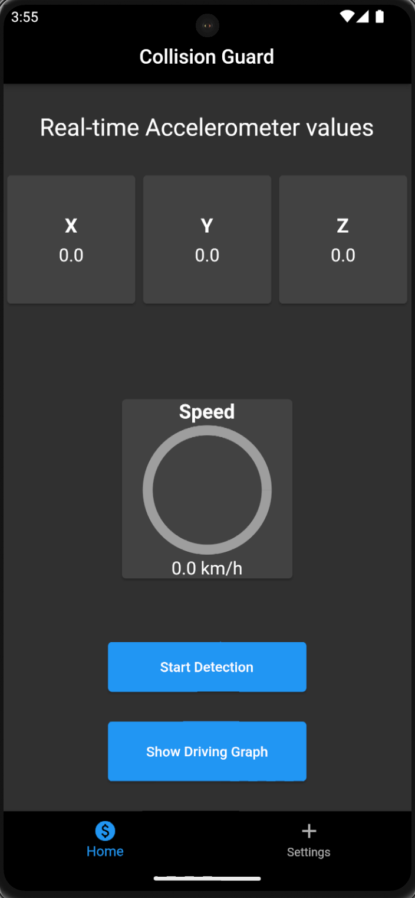

# Collision Guard

## Introduction

This is an Android App based on flutter which will be used to detect collisions. This app leverages accelerometer sensors on the device which are used to send a text to emergency contacts in case it detects a collision.

## Screens

### Home Screen

As you can see, this is the
