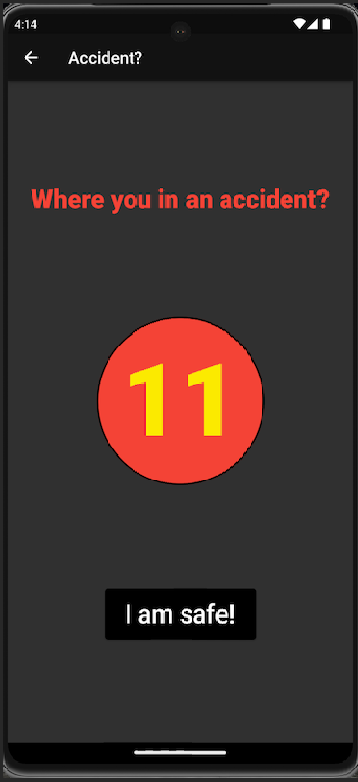
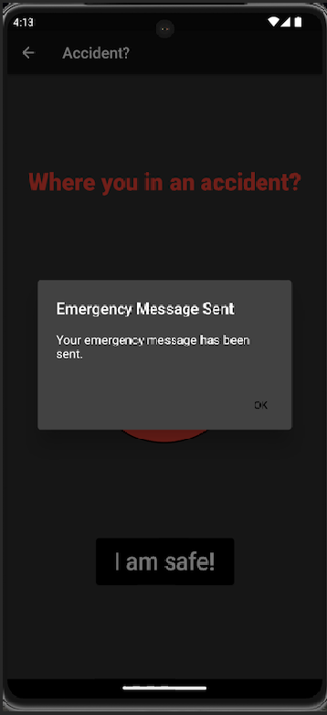
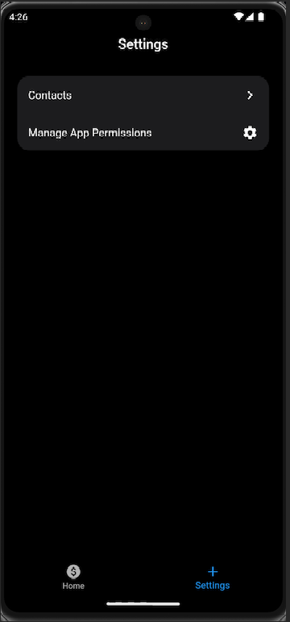
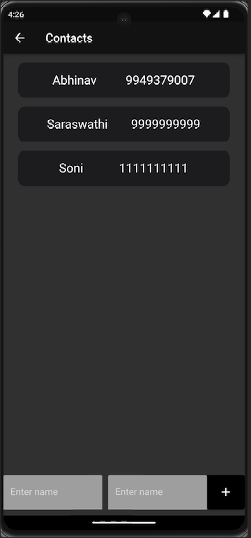
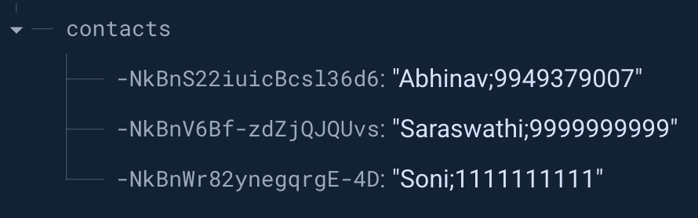

# Collision Guard

## Introduction

This is an Android App based on flutter which will be used to detect collisions. This app leverages accelerometer sensors on the device which are used to send a text to emergency contacts in case it detects a collision.

## Screens

### Home Screen

As you can see, this is the home screen of the app.

- The first row of widgets namely X, Y, and Z are the accelerometer value in their respective axis.
- The widget in the middle is for the speed which updates as the mobile device moves.
- As soon as you click the button "Start Detection", the values are tracked.
- You can click "Show Driving Graph" to look at how your acceleration and speed were during your drive.

### Graph Screen

This is the graph screen.

- This screen contains X, Y, and Z, accelerometer values alon with the Speed.
- This page can help us look back at our driving and maybe understand how this might have impacted the mileage.
- We also have an "Export data" button which will will export the sensors data to a text file.

### Accident Screen

  
  
  

The following screenshots belong to the Accident? page.

- As soon as the page opens a 15 seconds timer starts.
- If you click I am safe within the 15 seconds, you go back to home page.
- If in case you do not and the timer runs out, emergency message is sent to your emergency contacts with your latitude and longitude information.

### Settings Screen

  
  
  

These images above correspond to the settings screen.

- The first image is what you get when you select the settings tab.
- When you click Conacts, you get the second screen.
- In this screen you have the contacts you saved which include their names and contact number.
- You have an option to add a new contact by entereding their name and mobile number in the bottom.
- You also have an option to delete the contacts by sliding the contact to left.
- All these contacts are saved on Firebase Realtime database as shown below.

