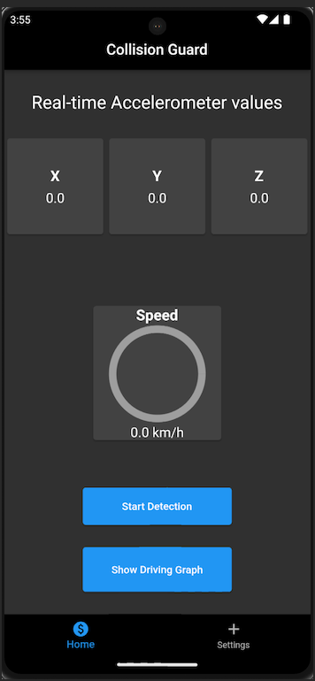
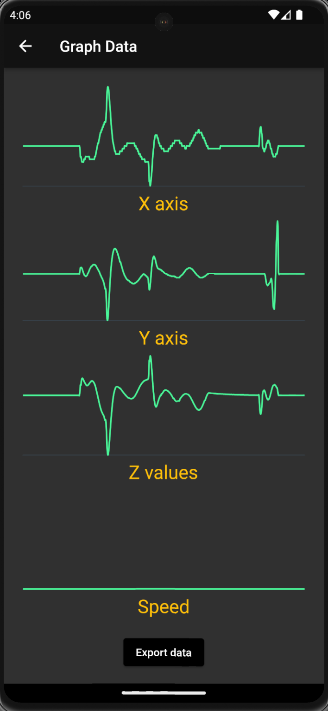

# Collision Guard

## Introduction

This is an Android App based on flutter which will be used to detect collisions. This app leverages accelerometer sensors on the device which are used to send a text to emergency contacts in case it detects a collision.

## Screens

### Home Screen

As you can see, this is the home screen of the app.

- The first row of widgets namely X, Y, and Z are the accelerometer value in their respective axis.
- The widget in the middle is for the speed which updates as the mobile device moves.
- As soon as you click the button "Start Detection", the values are tracked.
- You can click "Show Driving Graph" to look at how your acceleration and speed were during your drive.

### Graph Screen

This is the graph screen.

- This screen contains X, Y, and Z, accelerometer values alon with the Speed.
- This page can help us look back at our driving and maybe understand how this might have impacted the mileage.
- We also have an "Export data" button which will will export the sensors data to a text file.
