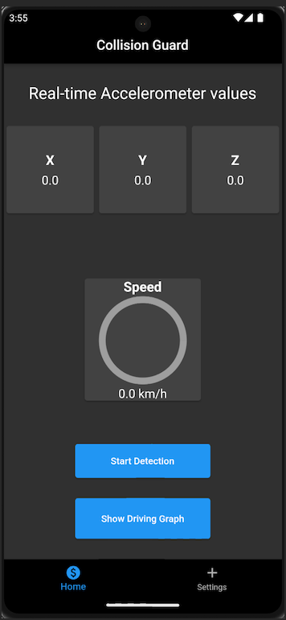
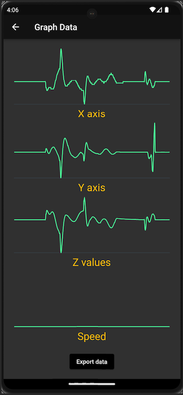
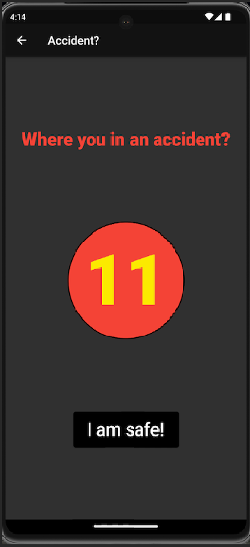
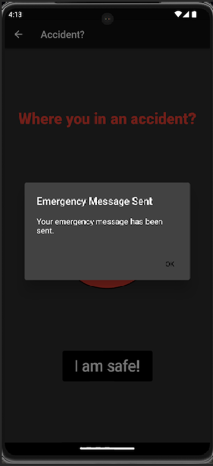
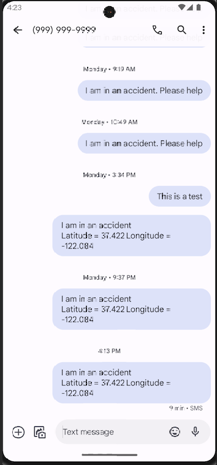
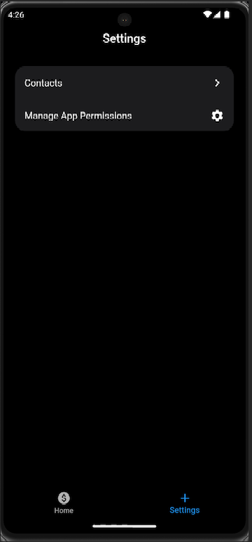
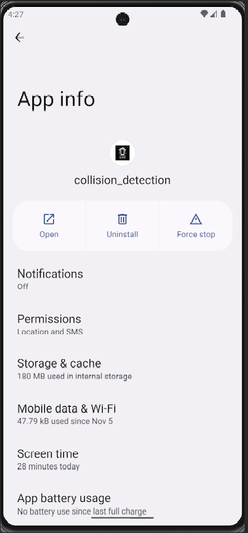
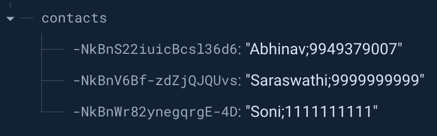
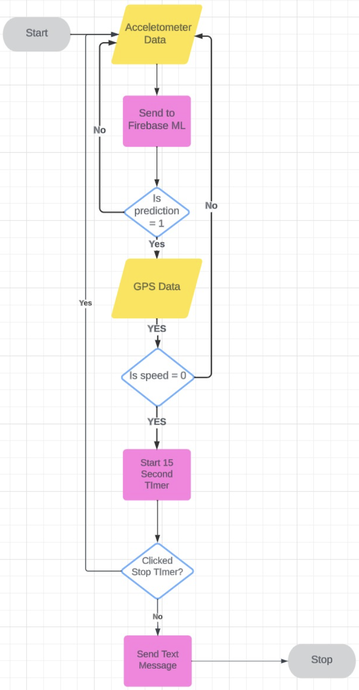

# Collision Guard

## Introduction

This is an Android App based on flutter which will be used to detect collisions. This app leverages accelerometer sensors on the device which are used to send a text to emergency contacts in case it detects a collision.

## Presentation Link

[YouTube Presentation URL](https://youtu.be/ebsTt9OCRxs)

## Screens

### Home Screen

<div align="center">
  
</div>

As you can see, this is the home screen of the app.

- The first row of widgets namely X, Y, and Z are the accelerometer value in their respective axis.
- The widget in the middle is for the speed which updates as the mobile device moves.
- As soon as you click the button "Start Detection", the values are tracked.
- You can click "Show Driving Graph" to look at how your acceleration and speed were during your drive.

### Graph Screen

<div align="center">
  
</div>

This is the graph screen.

- This screen contains X, Y, and Z, accelerometer values alon with the Speed.
- This page can help us look back at our driving and maybe understand how this might have impacted the mileage.
- We also have an "Export data" button which will will export the sensors data to a text file.

### Accident Screen

<div align="center">
  
  
  
</div>

The following screenshots belong to the Accident? page.

- As soon as the page opens a 15 seconds timer starts.
- If you click I am safe within the 15 seconds, you go back to home page.
- If in case you do not and the timer runs out, emergency message is sent to your emergency contacts with your latitude and longitude information.

### Settings Screen

<div align="center">
  
  
  
</div>

These images above correspond to the settings screen.

- The first image is what you get when you select the settings tab.
- When you click Conacts, you get the second screen.
- In this screen you have the contacts you saved which include their names and contact number.
- You have an option to add a new contact by entereding their name and mobile number in the bottom.
- You also have an option to delete the contacts by sliding the contact to left.
- All these contacts are saved on Firebase Realtime database as shown below.

<div align="center">
  
</div>

## Implementation

<div align="center">
  
</div>

In the flow chart above:

- When the app opens, the user has to click Start detecting. This is when the cycle begins.
- The accelerometer data is sent to the ML model deployed on Firebase continuously.
- As long as the prediction label is 0 (driving) we keep looping through the process.
- If the prediction is 1 (accident), the system looks at the GPS speed and if that is also 0 at that moment, the app starts the 15 seconds timer.
- If Stop timer is clicked before timer runs out, we go back to the home screen and detecting continues.
- If it is not clicked, the timer takes the contact data from firebase and sends all of those contacts a text message with your coordinates.

## Steps to run (Method 1)

### Prerequisites

- To run this file, you will need to install and setup flutter in your laptop.

- The emulator which was best tested for this app is a Pixel 7 Pro with API 33.

### 1. Clone the project

```
git clone https://github.com/kompellabhinav/collision-guard.git
```

### 2. Go to the project directory

```
cd collision-guard
```

### 3. Install the dependencies

```
flutter pub get
```

### 4. Run the flutter app

```
flutter run
```

## Steps to run (Method 2)

### Using apk

- Find the file named **app-release.apk** on the root foler
- Drag and drop the apk file on to the emulator.
- Open all apps on the emulator and open app names collision_detection.
